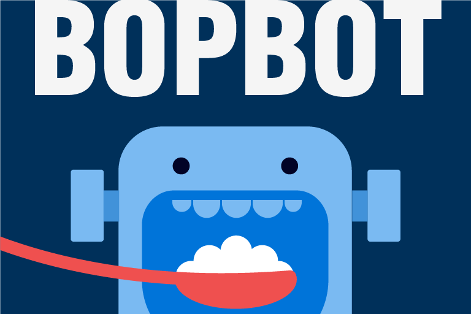

# Bopbot 

Making mealtime awesome. Check out [the running application](https://slack.com/oauth/authorize?scope=bot,channels:write,im:write,im:history,reminders:write&state=install&client_id=70107175334.85498289508) or look at the [installation instructions](INSTALL.md).

## It began with a rumbling belly...

It’s 1:00pm, just outside the office front door. Your stomach grumbles in protest, but you and your co-workers are still locked in heated debate over Chinese versus pizza.

It’s 6:30pm. The setting sun’s rays catch a lone tear inching down your cheek, as you realize your friends have left for dinner without you. _Again_.

It’s 9:45pm and you’re dreaming of an easy way to find delicious restaurants nearby for you and your co-workers. You dream of an app that not only finds these nearby treasures, but also streamlines the endless cycle of _“I don’t know, what do you wanna eat?”_ and even reminds Johnny that you want to leave in 15 minutes... _oh Johnny, always late_. You let this sweet, idyllic dream linger for a delicious moment longer, and then trudge to McDonald’s for the fourth night in a row.

But that dream, which you dare not hope for, lest your spirit be crushed. Take heart. _It’s real_.

Introducing Bopbot (named for 밥, the Korean word for ‘rice’ and/or ‘meal’). Just install, authorize with one click, and instantly chat your way into suggestions for good eats in your area. Bopbot will conveniently poll your friends and let everyone know the winning restaurant. It even sends reminders.. no hungry belly left behind. And it does all of this with a kind but plucky spirit that makes Siri sound old and crotchety.

Bopbot. Making mealtime awesome.

 

## What's Behind The Curtain?

The current implementation of B0pb0t is a sturdy balance of Amazon Web Services -- Lambda, APIGateway, DynamoDB, and SNS. Our server-less architecture sits behind the Slack API and makes friendly requests to the Yelp API as needed.

The cheerful and friendly UI/UX is a mix of Queen Bee's creative design resources, and the dynamic fusion of the team's combined wit, candor, and love (with sprinkles on top).

## Flashbacks, Finger Snaps, and the Future 

This project was conducted by a spirited task force of the MyMusicTaste Development Division. The server-less wizard Kokonak designed, built, tested, and deployed most of the architecture, with some help from Pwalle and Nujabes. Queen Bee was the team's Right Brain, crafting up the UI/UX with some ```[mostly unnecessary]``` suggestions from the others. Nujabes spearheaded and managed the effort like Gordon Ramses, and Pwalle was given sovereign right over the copywriting.

We would like to proudly recognize the work accomplished during the _short five weeks_ allotted for this project, and pour libations to the challenges and lessons along the way. 
 
Tasty kudos go to Kokonak, who bravely forged his way through a first-time tango with AWS Lambda, DynamoDB, APIGateway and SNS. The architectural obstacles were many.. especially Slack API's required 3 second maximum response time and the statelessness of Lambda. He trounced these issues with a clever pairing with DynamoDB and SNS, making the resulting system not only robust, but also scalable.

We thank the rest of the intrepid team as well, for supporting Kokonak on his mission. Lastly, we thank Amazon and especially Amazon Web Services for providing the necessary infrastructure for this project and many others, of course not just our own (TLDR: shut up and take our money).

The future is bright for our plucky Bopbot. Here's the shortlist:

* We plan to leverage AWS CloudFormation to allow brainless installation and enable us to upload to the Slack application directory.
* Once gilded with the architectural final touches, we will open source Bopbot and share it with the development community (생활코딩) here in Korea. Korea largely lacks a unified, reliable, and updated restaurant location service, but Bopbot could fill that gap with data contributions from ever-hungry development teams.
* We love the friendly face of Bopbot, but we hope to harness some machines to make her even more human! The MyMusicTaste data team is currently building a data warehouse and modeling infrastructure using AWS Redshift, EC2, SQS, and other resources. We will use this infrastructure in conjunction with natural language processing to smooth conversation with Bopbot, and build predictive models from usage data to improve her suggestions.
* As always, there is a long list of gold plating for the UI/UX. Minimally, we'd like to fix a Slack feature with reminders that auto-magikally pushes past times to the next day, and use [this service](https://github.com/smashwilson/slack-emojinator) to auto-install our custom emoji on users' Slack.
